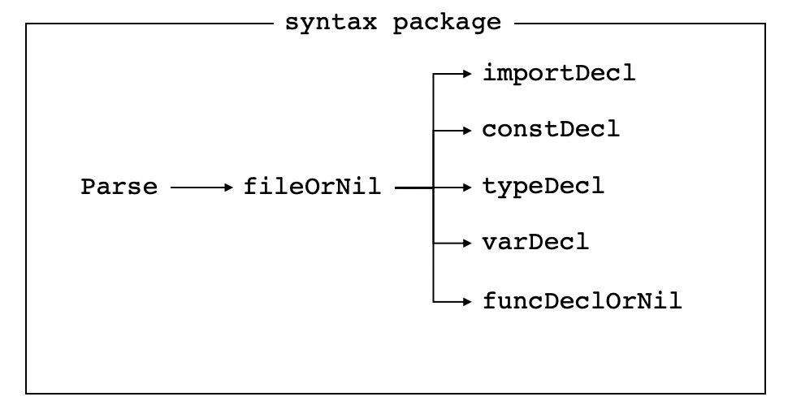

## はじめに

この記事は、[Go3 Advent Calendar 2019](https://qiita.com/advent-calendar/2019/go3)の9日目の記事です。

普段、私たちは何気なく`iota`を利用しています。
しかし、私は`iota`を使っていくうちに、「誰が1ずつインクリメントしてくれているんだろう...そもそもiotaってなんなんだろう...」と不思議に思うようになりました。

```go
const (
  A = iota + 1 // 1
  B            // 2..
  C            // 3... どうやってインクリメントとされていくんだ?
)
```

そのことが気になった私は、`iota`がどのようにコンパイラによって扱われるかを調べてみることにしました。

## `iota` とは

念の為、`iota`とは何か、おさらいしておきましょう。
`iota` は、定数に整数の連番を割り振るために用意された仕組みです。

```go
type Weekday int

const (
    Sunday Weekday = iota // 0
    Monday                // 1
    Tuesday               // 2
    Wednesday             // 3
    Thursday              // 4
    Friday                // 5
    Saturday              // 6
)

const (
    Shinjuku int = iota // 0    (iota=0)
    Yoyogi              // 1    (iota=1)
    Shibuya      = 999  // 999  (iota=2)
    Harajuku            // 3    (iota=3)
)

const (
    A, B = iota  // 0, 0
    C, D, E      // 1, 1, 1
    F, G, H, I   // 2, 2, 2, 2
    J            // 3
)
```

そして、`iota`は[事前宣言済み識別子であり、型なしの数値定数です](/posts/2019/12/iota-as-a-token)。
なぜ`iota`は定数であるにも関わらず、0から始まる整数の連番を返し、別の`const`ではまた0から始まるのでしょうか。

## 本題の前に、2つの前提

本章では、`iota`の値がいつどのように決定されるかを説明するために、以下を前提知識として共有します。

* Goコンパイラ `gc` によるコンパイルの流れ
* 「定数の宣言」の文法と各名称

### 前提1: Goコンパイラ `gc` によるコンパイルの流れ

どのタイミングで `iota` の値が計算されるかを知るためには、コンパイルの流れを知る必要があります。

Goコンパイラ`gc`は、大まかにいえば以下の手順に従ってコンパイルを行います。

1. `syntax`パッケージ  
    1.1 ソースコードを字句リストへ分割  
    1.2 字句リストを構文ツリーへ変換  
1. `gc`パッケージ  
    2.1 構文ツリーからAST  
    2.2 型チェック  
    2.3 SSA(中間表現)へ変換  
1. `ssa`パッケージ  
    3.1 SSAを最適化する  
    3.2 機械語を生成  

### 前提2: 「定数の宣言」の文法と各名称

本章では、以後の説明のために、「定数の宣言」の文法と各名称を示します。

「定数の宣言」の文法をEBNF形式で表現すると、以下の通りとなります。

```go
ConstDecl      = "const" ( ConstSpec | "(" { ConstSpec ";" } ")" ) .
ConstSpec      = IdentifierList [ [ Type ] "=" ExpressionList ] .
IdentifierList = identifier { "," identifier } . // 識別子のリスト
ExpressionList = Expression { "," Expression } . // 式のリスト
```

つまり、定数の宣言において、それぞれの部分の名前は以下の通りです。
それぞれの名称は、このあとの説明で用いますので、覚えておいてください。

<div class="gatsby-highlight" data-language="go" style="
    font-size: 24px;
"><pre class="language-go"><code class="language-go"><span class="token keyword">const</span> <span class="token punctuation">(</span>
  <ruby style="
    background: #FCE4EC;
    padding: 18px 6px 2px;
"><ruby style="
    background: #80deea;
">A<span class="token punctuation">,</span> B<span class="token punctuation">,</span> C <rt style="font-size: 16px;color: #006c7a;font-weight: bold;">IdentifierList</rt></ruby> <span class="token operator">=</span> <ruby style="
    /* border: 1px solid; */
    background: #FFC107;
"><span class="token string">1</span><span class="token punctuation">,</span> <span class="token string">2</span><span class="token punctuation">,</span> <span class="token string">3</span><rt style="
    text-align: center;
    font-size: 16px;
    color: #994c00;
    font-weight: bold;
    ">ExpressionList</rt></ruby><rt style="
    font-size: 17px;
    color: #E91E63;
    font-weight: bold;
">ConstSpec</rt></ruby>
  <ruby style="
    background: #FCE4EC;
    padding: 18px 6px 2px;
"><ruby style="
    background: #80deea;
">D<span class="token punctuation">,</span> E<span class="token punctuation">,</span> F <rt style="font-size: 16px;color: #006c7a;font-weight: bold;">IdentifierList</rt></ruby> <span class="token operator">=</span> <ruby style="
    /* border: 1px solid; */
    background: #FFC107;
"><span class="token string">"foo"</span><span class="token punctuation">,</span> <span class="token string">"bar"</span><span class="token punctuation">,</span> <span class="token string">"baz"</span><rt style="
    text-align: center;
    font-size: 16px;
    color: #994c00;
    font-weight: bold;
    ">ExpressionList</rt></ruby><rt style="
    font-size: 17px;
    color: #E91E63;
    font-weight: bold;
">ConstSpec</rt></ruby>
<span class="token punctuation">)</span></code></pre></div>

## 「定数の宣言」がASTになるまで

### ソースコードが構文ツリーになるまで

ここから、本題である「`iota`がどのようにコンパイラによって扱われるか」を解説します。

結論からいえば、定数の宣言、つまりConstDeclおよびConstSpecが字句解析され、構文解析され、ASTへ変換される過程で、`iota`のカウンタがいつ0へリセットされるか、各定数に対してどんな値を返すかが決定されます。

まず、`syntax`パッケージによって、ソースコードが構文ツリーへ変換されるようすを見てみましょう。

<ol style="font-size: 14px;">
<li style="margin: 0;"><code class="language-text">syntax</code>パッケージ<br>
1.1 ソースコードを字句リストへ分割<br>
1.2 字句リストを構文ツリーへ変換  </li>
<li style="margin: 0; opacity: 0.3;"><code class="language-text">gc</code>パッケージ<br>
2.1 構文ツリーからAST<br>
2.2 型チェック<br>
2.3 SSA(中間表現)へ変換  </li>
<li style="margin: 0; opacity: 0.3"><code class="language-text">ssa</code>パッケージ<br>
3.1 SSAを最適化する<br>
3.2 機械語を生成  </li>
</ol>

まず、gcは、.goファイルごとに`syntax`パッケージの`Parse`関数を呼びます。
呼び出された`Parse`関数は、字句解析をした後、これを構文ツリーへ変換するために`fileOrNil`関数を呼びます。
`fileOrNil`関数は、以下の流れに従って処理を行います。

1. File構造体を初期化する  
   File構造体は、そのファイルで定義されているimport、const、var、typeそしてfuncの一覧を保持する`DeclList`フィールドを持つ
1. パッケージ名を取得する
1. import文にて指定されているパッケージの一覧を`importDecl`関数によって取得し、`DeclList`へ加える
1. ファイルのトップレベルにある定数、変数、型そして関数の宣言を、それぞれ`constDecl`、`varDecl`、`typeDecl`、`funcDeclOrNil`によって、`Decl`インタフェースを持つ構造体`ConstDecl`、`VarDecl`、`TypeDecl`、`FuncDecl`へ変換されます。



`ConstDecl`構造体は「ConstDecl」という名前ではありますが、実際には先程の文法でいうConstSpecを表しています（不思議ですね）。
また、`ConstDecl`構造体はGroupフィールドを持っていて、このGroupフィールドはそれぞれのConstSpecがどのConstDeclに属するかを保持します。たとえば、同じConstDeclの中で宣言されたConstSpecが`ConstDecl`構造体に変換された時、Groupフィールドの値が同じになります。そして、他のConstDeclの中で宣言されたConstSpecが変換された`ConstDecl`構造体とは、Groupフィールドの値が異なります。

### 構文ツリーがASTになるまで

次に、`gc`パッケージによって、構文ツリーがASTへ変換されるようすを見てみましょう。

<ol style="font-size: 14px;">
<li style="margin: 0; opacity: 0.3;"><code class="language-text">syntax</code>パッケージ<br>
1.1 ソースコードを字句リストへ分割<br>
1.2 字句リストを構文ツリーへ変換  </li>
<li style="margin: 0;"><code class="language-text">gc</code>パッケージ<br>
2.1 構文ツリーからAST<br>
<span style="opacity: 0.3">2.2 型チェック</span><br>
<span style="opacity: 0.3">2.3 SSA(中間表現)へ変換</span></li>
<li style="margin: 0; opacity: 0.3"><code class="language-text">ssa</code>パッケージ<br>
3.1 SSAを最適化する<br>
3.2 機械語を生成  </li>
</ol>

`gc`パッケージは、`syntax`パッケージによって得られた`File`構造体を受け取り、`Node`構造体のツリーへ変換したのち、この木構造をたどって型チェックし、SSA(中間表現)へ変換します。

そして、この`Node`構造体は、`Xoffset`という、色々な値を保存しておくためのフィールドを持っています。さらに、この`Xoffset`フィールドこそが`iota`の値を保持します。実際に、`gc`パッケージのソースコードの`Node`構造体を定義する部分を読むと、コメントに

> Named OLITERALs use it to store their ambient iota value.
> OCLOSURE uses it to store ambient iota value, if any.

とあります。

```go
type Node struct {
      // Tree structure.
    // Generic recursive walks should follow these fields.
    Left  *Node
    Right *Node
    Ninit Nodes
    Nbody Nodes
    List  Nodes
    Rlist Nodes

    // ...

    // Various. Usually an offset into a struct. For example:
    // ...
    // - Named OLITERALs use it to store their ambient iota value.
    // ...
    // - OCLOSURE uses it to store ambient iota value, if any.
    // Possibly still more uses. If you find any, document them.
    Xoffset int64
```

また、`Node`構造体は`SetIota`関数を持ちます。この関数が`Node`構造体の`Xoffset`フィールドにiotaの値を代入しています。

```go
func (n *Node) SetIota(x int64) {
    n.Xoffset = x
}
```

では、この`SetIota`関数は、どこから呼ばれるのでしょうか。
答えは、`ConstDecl`構造体を`Node`構造体へ変換する、`constDecl`関数です。
`constDecl`関数は、`ConstDecl`構造体へ変換されたConstSpecを引数に受け取り、これを`Node`のリストへ変換します。
そして、ConstSpecが属するConstDeclが異なる場合、カウンタを0にリセットします。
加えて、`Node`のリストへの変換が終わったあと、カウンタをインクリメントします。

```go
type constState struct {
    group  *syntax.Group
    typ    *Node
    values []*Node
    iota   int64
}

func (p *noder) constDecl(decl *syntax.ConstDecl, cs *constState) []*Node {
    // 最後に処理したConstSpecと今処理しているConstSpecの
    // Groupが異なる場合はiotaのカウンタをリセットする
    if decl.Group == nil || decl.Group != cs.group {
        *cs = constState{
            group: decl.Group,
        }
    }

    // そのCountSpecにて宣言された定数名の一覧を取得する
    names := p.declNames(decl.NameList)
    // ...

    nn := make([]*Node, 0, len(names))
    for i, n := range names {
        // ...
        // iotaのカウンタ値をiota値として渡す
        n.SetIota(cs.iota)

        nn = append(nn, p.nod(decl, ODCLCONST, n, nil))
    }

    // ...

    // iotaのカウンタをインクリメントする
    cs.iota++

    return nn
}
```

### まとめ

以上より、`iota` の値は 構文解析の結果からASTが生成される時に、`noder.constDecl`関数によって決定されるものかと思われます。  
本記事に間違いがございましたら、[Twitter](https://twitter.com/uniuniunicode)のリプライにてお知らせ下さると幸いです。
拙い記事ですが、ここまでお付き合い頂きありがとうございました。

## 参考記事

- [Go compiler internals: adding a new statement to Go - Part 1](https://eli.thegreenplace.net/2019/go-compiler-internals-adding-a-new-statement-to-go-part-1/)
- [Goを読むその2：compileコマンド（構文解析まで）](https://qiita.com/junjis0203/items/616c00086eb336153f4f)
- [Golangのconst識別子iotaの紹介](https://qiita.com/curepine/items/2ae2f6504f0d28016411)